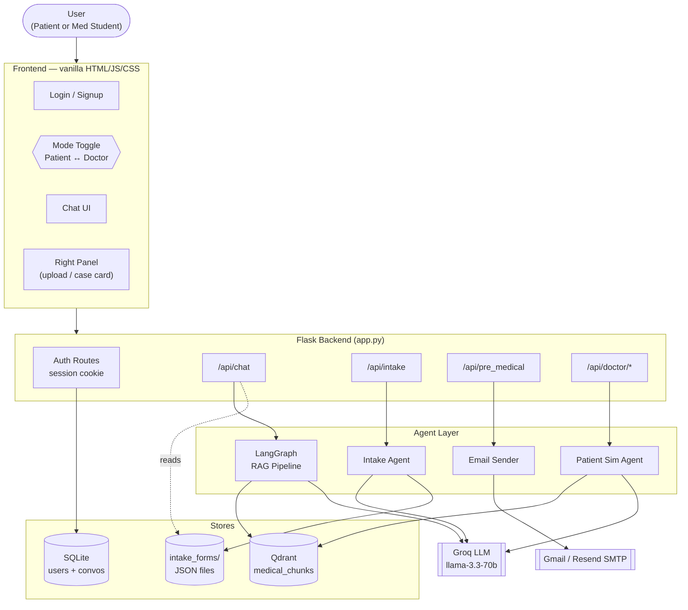
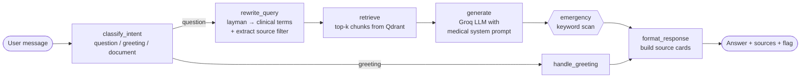
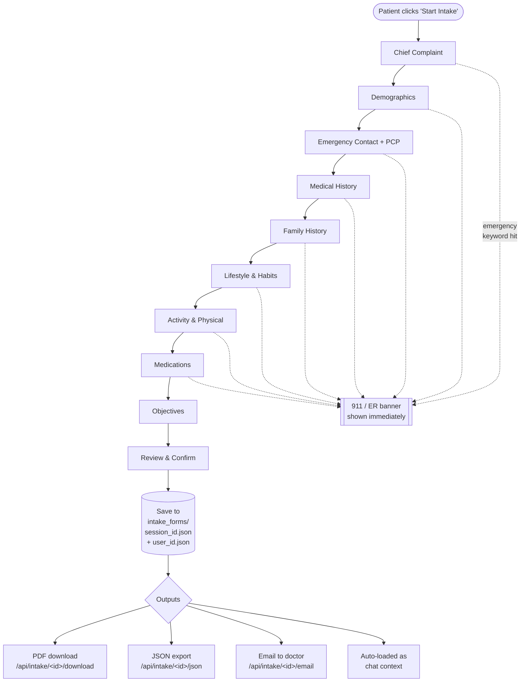
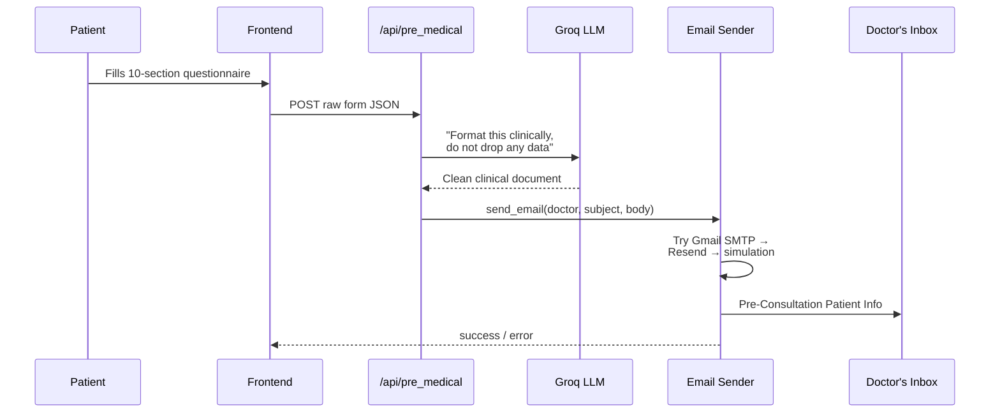
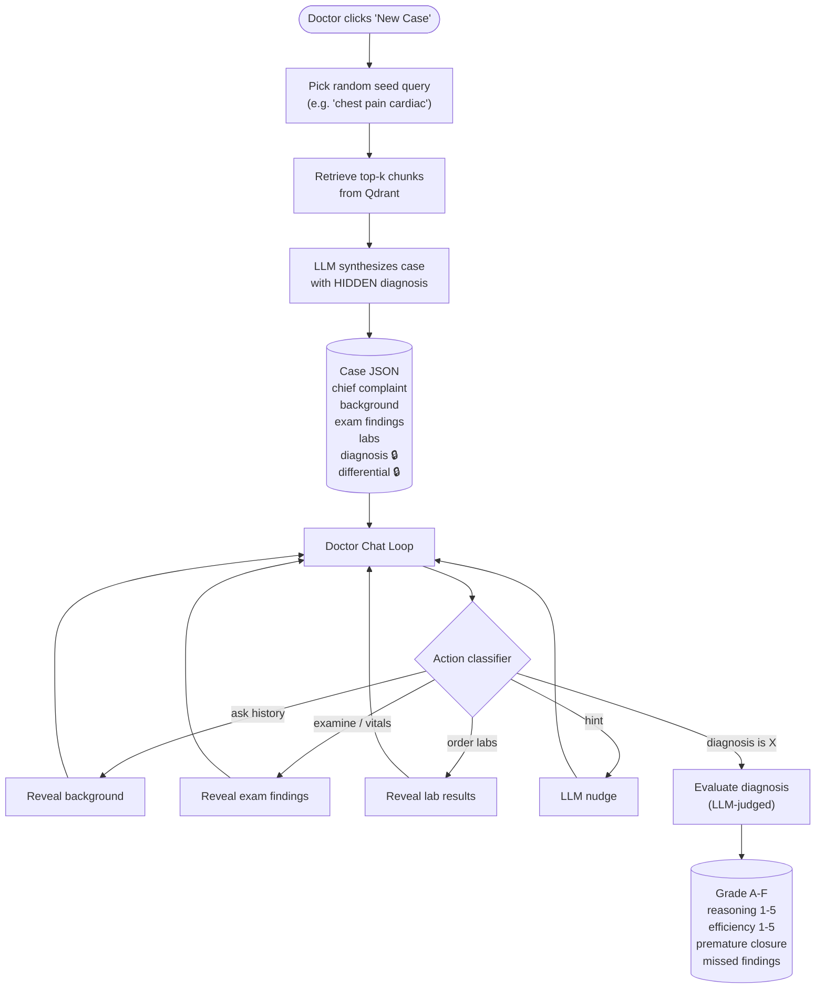
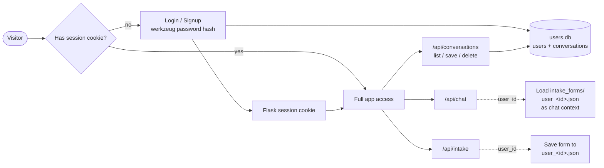

# Agentic AI Healthcare Search

A multi-agent medical assistant built on top of a RAG pipeline. It is **two products in one app**:

1. **Patient Mode** — a source-grounded medical Q&A chatbot with conversational intake, document upload, and an automated pipeline that emails a clinical-grade pre-consultation summary to the patient's doctor.
2. **Doctor Practice Mode** — a clinical training simulator where med students interview an LLM that role-plays a patient, then submit a diagnosis and get scored on reasoning, efficiency, and premature closure.

Both modes share the same Qdrant medical knowledge base, the same Groq LLM, and a SQLite-backed auth layer that ties conversations and intake history to a real user account.

---

## Table of Contents
- [System at a Glance](#system-at-a-glance)
- [How a Patient Question Flows](#how-a-patient-question-flows)
- [Conversational Intake → Email-to-Doctor](#conversational-intake--email-to-doctor)
- [Doctor Practice Mode](#doctor-practice-mode)
- [Auth & Persistence](#auth--persistence)
- [Project Layout](#project-layout)
- [Setup](#setup)
- [API Reference](#api-reference)
- [Design Principles](#design-principles)

---

## System at a Glance



The backend is a thin Flask shell. **All intelligence lives in the agent layer**, which is what makes this system "agentic" rather than just a chatbot:

| Agent | Lives in | What it does |
|---|---|---|
| **RAG agent** | `pipeline/main.py` | LangGraph state machine: classify intent → rewrite query → retrieve → generate → format |
| **Intake agent** | `pipeline/agents/intake_agent.py` | Multi-turn conversational form-filler with emergency detection at every step |
| **Patient simulator** | `pipeline/agents/patient_sim_agent.py` | Generates a hidden case, role-plays the patient, gates info, scores the diagnosis |
| **Email agent** | `pipeline/email_sender.py` | LLM formats raw form data into a clinical document, then dispatches via Gmail/Resend |

---

## How a Patient Question Flows

When a logged-in patient sends a chat message, the LangGraph orchestrator routes it through this state machine:



Two non-obvious things this does:

- **Query rewriting before retrieval.** "My belly hurts" gets rewritten to clinical vocabulary the corpus actually uses (e.g., "abdominal pain epigastric"), which dramatically improves chunk quality.
- **Intake-aware generation.** If the user has a saved intake form (`intake_forms/user_<id>.json`), it's loaded and passed into the prompt so the LLM personalizes the answer to that patient's history.

---

## Conversational Intake → Email-to-Doctor

The intake system is a **stateful conversational agent**, not a static form. It walks the patient through 9 steps, runs an emergency check on every reply, and produces a structured JSON form that downstream agents consume.



The richer **pre-medical questionnaire** (`/api/pre_medical`) is a separate longer form covering insurance, immunizations, ROS, and specialty-specific questions. It's piped through an LLM-powered formatter before being mailed:



The cascading transport (`Gmail SMTP → Resend → console simulation`) means the system always **degrades gracefully**: a developer with no email credentials still sees the rendered email in their terminal instead of a 500 error.

---

## Doctor Practice Mode

This is the multi-agent half of the system. A med student toggles "Doctor Mode" and gets a fresh patient simulation generated **on demand** from the same Qdrant corpus that powers patient Q&A — no static case files, no canned scripts.



The right-side panel mirrors a real clinical workflow:

| Tab | What it does |
|---|---|
| **Actions** | Quick-action chips ("Take history", "Auscultate lungs", "Order CBC") and a "Submit Diagnosis" button |
| **Differential** | Build a hypothesis list, click "Check" — each gets marked correct / plausible / unlikely against the hidden case |
| **Quiz** | Generates 3 LLM-written MCQs grounded in the active case |
| **Results** | Locked until diagnosis is submitted — then reveals scores, missed findings, and the full differential |

**Why this matters:** the same Qdrant chunks that ground a patient's question are reused as clinical seed material for the simulator. One corpus, two completely different agentic behaviors.

---

## Auth & Persistence

Recently added — gated chat and intake behind a real user account so conversations and intake history persist across sessions.



Auth is intentionally minimal: SQLite, Werkzeug password hashing, server-side session cookie. No JWTs, no OAuth — keeps the prototype simple while still scoping all per-user data correctly.

---

## Project Layout

```
.
├── app.py                         # Flask entrypoint — routes only, no business logic
├── db/
│   ├── auth.py                    # SQLite users + conversations
│   ├── ingestion.py               # Embed chunks → Qdrant
│   └── test_qdrant.py
├── pipeline/
│   ├── main.py                    # LangGraph RAG state machine
│   ├── retriever.py               # Qdrant query
│   ├── generator.py               # Groq prompt + medical system prompt
│   ├── prompts.py                 # All prompt templates
│   ├── email_sender.py            # Gmail → Resend → simulation cascade
│   └── agents/
│       ├── intake_agent.py        # Conversational intake state machine
│       └── patient_sim_agent.py   # Doctor-mode case gen + sim + scoring
├── data_collection/scripts/       # MSD scrapers + chunker (one-time)
├── frontend/                      # Vanilla HTML / JS / CSS
│   ├── index.html
│   ├── app.js                     # Mode switching, chat state, doctor panel
│   └── styles.css
├── intake_forms/                  # Saved intake JSON, keyed by session and user
├── uploads/                       # Patient document uploads
└── archive/                       # Legacy code — reference only
```

---

## Setup

**Prerequisites:** Docker, Python 3.10+, a Groq API key.

```bash
# 1. Start Qdrant
docker run -p 6333:6333 -v qdrant_storage:/qdrant/storage qdrant/qdrant:v1.2.0

# 2. Install deps
pip install -r requirements.txt

# 3. Add credentials to .env
#    GROQ_API_KEY=gsk_...
#    SECRET_KEY=<flask-session-secret>
#    GMAIL_USER=...           # optional, for real email
#    GMAIL_APP_PASSWORD=...   # optional
#    RESEND_API_KEY=...       # optional fallback

# 4. Ingest medical chunks (one-time, after Qdrant is up)
python db/ingestion.py

# 5. Run the app
python app.py
# → http://localhost:5000
```

Without email credentials, sends print to your terminal instead — the app still works end-to-end.

---

## API Reference

### Auth
| Method | Route | Purpose |
|---|---|---|
| POST | `/api/auth/signup` | Create account, returns user + sets session cookie |
| POST | `/api/auth/login` | Authenticate, sets session cookie |
| POST | `/api/auth/logout` | Clear session |
| GET | `/api/auth/me` | Current user (or null) |

### Patient Mode
| Method | Route | Purpose |
|---|---|---|
| POST | `/api/chat` | RAG chat (intake-aware if user has a saved form) |
| POST | `/api/upload` | Upload PDF/TXT/DOCX/image |
| POST | `/api/intake` | Multi-turn intake conversation |
| GET | `/api/intake/<id>/download` | Intake form as PDF |
| GET | `/api/intake/<id>/json` | Intake form as JSON |
| POST | `/api/intake/<id>/email` | Email completed intake to doctor |
| POST | `/api/pre_medical` | Process and email full pre-consultation form |
| GET/POST/DELETE | `/api/conversations[/id]` | Per-user conversation persistence |

### Doctor Practice Mode
| Method | Route | Purpose |
|---|---|---|
| POST | `/api/doctor/session` | Generate a fresh case, return session id + greeting |
| POST | `/api/doctor/chat` | Doctor message → simulated patient response (+ evaluation if diagnosis submitted) |
| POST | `/api/doctor/quiz` | Generate 3 MCQs from the active case |
| POST | `/api/doctor/differential` | Score the doctor's hypothesis list against the hidden case |

### Health
| Method | Route | Purpose |
|---|---|---|
| GET | `/api/health` | Liveness check |

---

## Design Principles

1. **Every patient answer is source-grounded.** The LLM is never asked to recall medical facts — it summarizes retrieved chunks and cites them. Sources are always returned to the UI.
2. **Emergency detection is non-negotiable.** Runs on every patient message and at every intake step. False positives are preferred to false negatives.
3. **The two modes are fully isolated.** Doctor sessions never touch patient state. Doctor mode bypasses the LangGraph pipeline entirely.
4. **Cases are dynamic.** No static case files. Every doctor session synthesizes a fresh patient from the existing medical corpus, so the trainee can't memorize the answers.
5. **Graceful degradation everywhere.** No Groq → chunk concatenation. No Qdrant → static fallback case. No SMTP → console simulation. The app never shows a blank error.
6. **Scoring is formative.** A wrong diagnosis with strong reasoning scores better than a lucky guess. Feedback names what was missed, not just whether the answer was right.
7. **The system is an information tool, not a doctor.** Every response carries a disclaimer, and emergency triggers always defer to 911 / ER.
